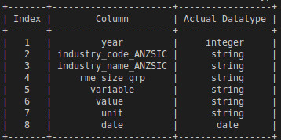

# Data Profiller

Generate reports from csv, tsv, fwf.

### For each column :
1. Print all column headers
2. Print all datatypes available in each column
3. Print actual datatype of each column
4. Print erroneous columns 
5. Print erroneous columns row number

## Installation

### From source 

Download the source code by cloning the repository or by pressing 'Download ZIP' on this page. Install by navigating to the proper directory and running
~~~
python setup.py install
~~~

### How to run :

 Run program by typing:

~~~ `python3 main.py (path)filename`

    example:

    `python3 main.py example.csv`

~~~

### Input

**Input csv file**

### Output

**Column headers**

**Columns and their available datatypes**

**Actual datatype of columns**

**Erroneous column with datatypes**

**Erroneous column with row numbers and datatypes**

